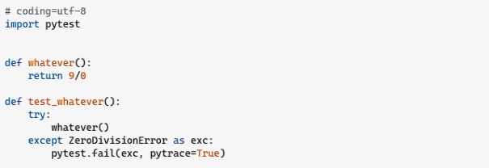
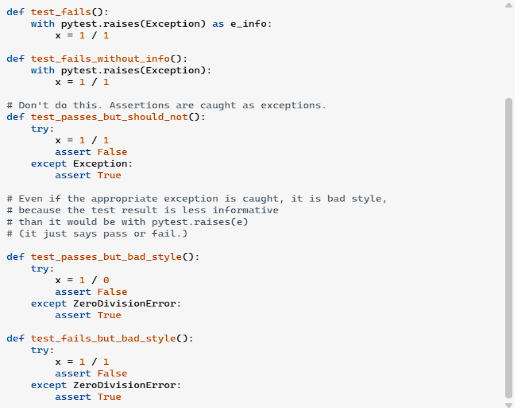
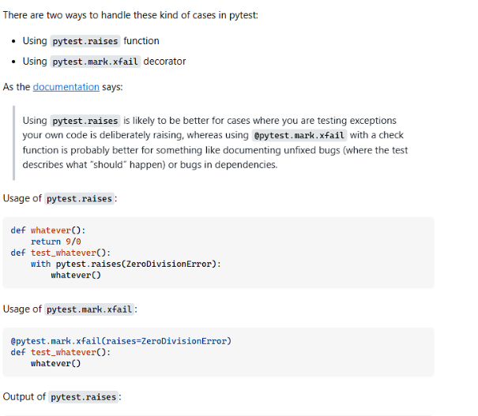
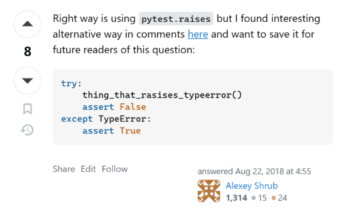

# Teste de Software 2025.1

### Componentes do grupo:
BRENNO DE FARO VIEIRA

DAVI SOUZA FONTES SANTOS

JOSÉ FREIRE FALCÃO NETO

HUMBERTO DA CONCEIÇÃO JÚNIOR

NEWTON SOUZA SANTANA JÚNIOR

**ATIVIDADE 1 - TESTES UNITÁRIOS DISCUTIDOS NO STACK OVERFLOW**

**“HOW DO I PROPERLY ASSERT THAT AN EXCEPTION GETS RAISED IN PYTEST?”**

**Sumário**

[**1. INTRODUÇÃO	3**](#_z1bdcrn3x77n)

[1.1. Pergunta escolhida	3](#_83lzlas1giqo)

[2.1. Reprodução do código	4](#_nbt56v3gam2w)

[2.2. Resposta aceita	4](#_lsg8uh9cnjvg)

[2.3. Outras respostas não aceitas	5](#_4yt9dvo2uzd)

[2.3.1. Resposta 1:	5](#_wlc9fuqh60qz)

[2.3.2. Resposta 2	6](#_vo4p77arzyip)

[**3. REFERÊNCIAS	7**](#_oarf2dw7cbge)

# 1.  **INTRODUÇÃO**
O Stack Overflow é amplamente reconhecido como a maior e mais confiável comunidade online para desenvolvedores e programadores. Lançado em 2008, o site opera como uma plataforma pública de perguntas e respostas, onde qualquer pessoa pode postar um desafio técnico e receber soluções de uma comunidade global de especialistas. O seu diferencial reside em um sistema de reputação e votação: as respostas são avaliadas pela comunidade por meio de votos positivos (upvotes) e negativos (downvotes), e o autor da pergunta pode marcar uma resposta como "aceita", indicando que ela resolveu efetivamente o problema. Essa estrutura meritocrática transforma o Stack Overflow em uma vasta biblioteca de conhecimento prático, validado coletivamente, tornando-o um recurso indispensável no dia a dia do desenvolvimento de software e uma fonte rica para a análise de problemas reais da engenharia de software, como o abordado neste trabalho.

Abaixo estão os links para o repositório criado no github e o vídeo tutorial respectivamente:

- <https://github.com/brenofaro/Teste_Software_2025_vieira_brenno>
- <https://drive.google.com/file/d/1FrJu6RdebCtBqRIGE-Gw7Zd5Lzek-FnA/view?usp=sharing>

## 1.1  **Pergunta escolhida**
“How do I properly assert that an exception gets raised in pytest?” (tradução: "Como verificar corretamente se uma exceção é lançada no pytest?")

<https://stackoverflow.com/questions/23337471/how-do-i-properly-assert-that-an-exception-gets-raised-in-pytest>

## 2.1 **Problema da questão**

A questão aborda a forma correta de testar se funções em Python lançam exceções esperadas ao utilizar o framework pytest.

O autor da pergunta tentou usar um bloco **try**...**except** para capturar a exceção e, em seguida, chamar pytest.fail(). No entanto, essa abordagem não funciona como esperado: ela faz o teste falhar justamente quando a exceção é lançada, o que é o comportamento contrário do desejado.

Em um teste unitário, o objetivo é verificar um comportamento específico do código. Por exemplo, se temos uma função que realiza divisão entre dois números, e sabemos que ao dividir por zero deve ocorrer uma exceção do tipo ZeroDivisionError, então o teste deve passar quando essa exceção for corretamente lançada.

No entanto, da forma que o autor implementou, o teste falha ao capturar a exceção, o que invalida a verificação do comportamento esperado. O teste, na prática, só passaria se nenhuma exceção fosse lançada, o que não condiz com a intenção original.

A forma correta de realizar esse tipo de verificação no pytest é utilizando o contexto **with** pytest.raises(...), que garante que o teste passa se e somente se a exceção esperada ocorrer.

## 2.1  **Reprodução do código**

## 2.2  **Resposta aceita**
Na resposta aceita, recomenda-se o uso **pytest.raises(Exception)** para levantar a exceção correta. Ainda é explicado que o uso do método **raises()** gera uma exceção com mais informações.

Exemplo do uso dado na resposta: 

## 2.3 **Outras respostas não aceitas**
   ### 2.3.1  **Resposta 1:**

A resposta está quase correta ao indicar o uso de pytest.raises(), que de fato é a maneira apropriada de verificar se uma exceção específica foi lançada durante a execução de um teste. No entanto, a menção ao uso de pytest.mark.xfail não contribui para a resolução do problema apresentado, visto que serve para marcar testes que são esperados falhar — normalmente por conta de bugs conhecidos ou comportamentos ainda não implementados — e não para verificar o lançamento de exceções de forma precisa. O uso de xfail nesse contexto apenas permite que o teste falhe sem impactar o resultado geral da suíte de testes, o que pode mascarar problemas reais.
### **2.3.2. Resposta 2**

Esta resposta demonstra pouca clareza com o uso de assert False e assert True dentro de try e except, não deixando explícito qual exceção esperada, tornando o teste menos legível. Não faz proveito dos recursos do pytest, que possui o método recomendado pytest.raises(), que descreve a exceção esperada e fornece relatórios detalhados automaticamente.

## 3.  **REFERÊNCIAS**
PYTEST. Pytest documentation. Disponível em: <https://docs.pytest.org/en/stable/>. Acesso em: 17 jun. 2025.

SIBENIK, Steven. How do I properly assert that an exception gets raised in pytest? Stack Overflow, 28 abr. 2014. Disponível em: <https://stackoverflow.com/questions/23337471/how-do-i-properly-assert-that-an-exception-gets-raised-in-pytest>. Acesso em: 17 jun. 2025.

